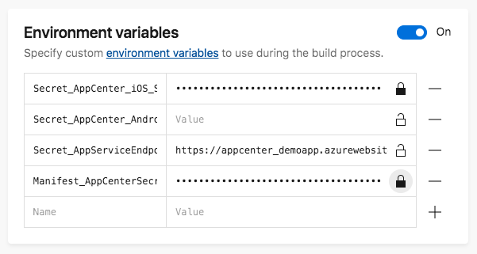

# AppCenter.DemoApp

> **NOTE** This repo targets the legacy v1.4 build of the Mobile.BuildTools. While this is still used without issue by thousands of apps, v1.4 is no longer supported. Please see the sample apps in the [Mobile.BuildTools](https://github.com/dansiegel/Mobile.BuildTools) repo and the docs for how to use v2.0 at [mobilebuildtools.com](https://mobilebuildtools.com).

This project was created using the Prism Template Studio & Developer Toolkit by Dan Siegel. Be sure to follow Dan on Twitter [@DanJSiegel](https://twitter.com/DanJSiegel). This app is meant as a demo to show how to secure your application code. You will notice that there is no `Info.plist` or `AndroidManifest.xml` in the iOS and Android projects. Both of these files instead exist as tokenized templates in the build folder. There are also no hard coded values for the AppCenter application secrets.

The [Mobile.BuildTools](https://github.com/dansiegel/Mobile.BuildTools) is able to handle these tasks easily for you. This project is using all of the defaults, however it is all configurable and customizable to allow you to inject secrets at build across multiple projects in a single solution, enable debugging output, and more.

| Platform | Status |
| -------- | ------ |
| Android | [](https://appcenter.ms) |
| iOS | [](https://appcenter.ms) |

## Getting the application to build locally

After cloning this repository to your local machine be sure to copy and rename the tokenized manifests from the build folder to the appropriate location.

**WARNING:** Android will automatically create a default AndroidManifest if you open Visual Studio or attempt to build before you have copied the template. For the purposes of this demo we don't actually require any tokens to be replaced for our Android build, however we do have a permission defined that will not be included in an auto generated Manifest. Be sure to replace the tokens with the appropriate values from AppCenter for your Info.plist.

Next create a file named `secrets.json` in the AppCenter.DemoApp project, and update it to look like the following:

```json
{
    "AppCenter_iOS_Secret": "{Your AppCenter iOS Application Secret HERE}",
    "AppCenter_Android_Secret": "{Your AppCenter Android Application Secret HERE}",
    "AppServiceEndpoint": "https://demo.contoso.com/"
}
```

## Setting Up AppCenter

You will need to setup your AppCenter build with whatever general settings you require. Then in the Environment Variables you will need to add a variable for each of the keys shown above for the `secrets.json`, note each will need to be prefixed with `Secret_`, so they become `Secret_AppCenter_iOS_Secret` and so on. Because we are also swapping out the Manifests we will need to add `Manifest_AppCenterSecret` for our iOS build so that it can replace the token. Once you've added these variables you are all set and ready to build. As you'll see in the image below while we do need to declare the Android Secret variable, we don't actually need to provide it a value since it's platform specific.


